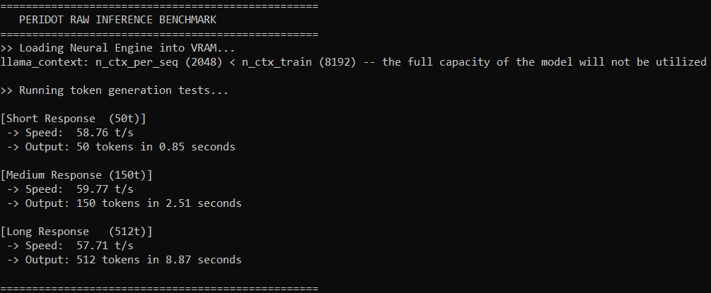
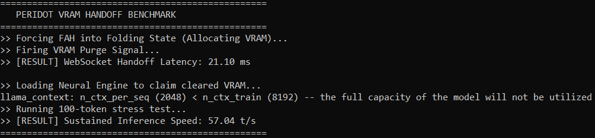
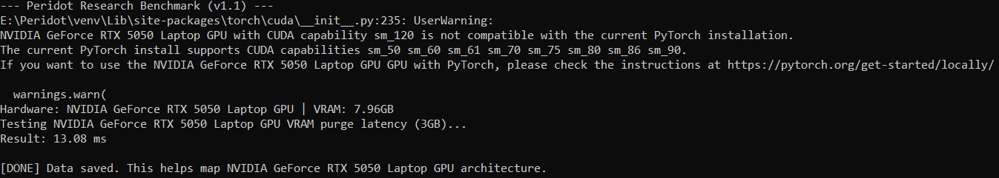

<div align="center">

```
██████╗ ███████╗██████╗ ██╗██████╗  ██████╗ ████████╗
██╔══██╗██╔════╝██╔══██╗██║██╔══██╗██╔═══██╗╚══██╔══╝
██████╔╝█████╗  ██████╔╝██║██║  ██║██║   ██║   ██║   
██╔═══╝ ██╔══╝  ██╔══██╗██║██║  ██║██║   ██║   ██║   
██║     ███████╗██║  ██║██║██████╔╝╚██████╔╝   ██║   
╚═╝     ╚══════╝╚═╝  ╚═╝╚═╝╚═════╝  ╚═════╝    ╚═╝   
```

### `SOVEREIGN AI KERNEL — v1.2 BETA`

[](https://github.com/uncoalesced/Peridot)
[](https://github.com/uncoalesced/Peridot)
[](https://github.com/uncoalesced/Peridot)
[](LICENSE)
[](https://python.org)

<br>

> **⚠️ BETA**  
> Medical research module under validation. [Report issues](https://github.com/uncoalesced/Peridot/issues).

<br>

**Engineered by [uncoalesced](https://github.com/uncoalesced)**

*GPU-accelerated, air-gapped AI runtime. Zero telemetry. Zero cloud dependency.*

<br>

</div>

---

## `> OVERVIEW`

Local LLM runtime with permission-based function calling. Runs on your hardware. Logs all actions.

```
┌─────────────────────────────────────────────────────────┐
│  USER QUERY                                             │
│     │                                                   │
│     ▼                                                   │
│  PERMISSION LAYER  ──── constitution.json               │
│     │                        │                          │
│     │              (block / allow / modify)             │
│     │                                                   │
│     ▼                                                   │
│  INFERENCE ENGINE  ──── localhost:5000 (air-gapped)     │
│  Llama-3-8B-Instruct                                    │
│     │                                                   │
│     ▼                                                   │
│  AUDIT LOG  ──── immutable, SHA-256 verified            │
└─────────────────────────────────────────────────────────┘
```

---

## `> PERFORMANCE`

**Hardware:** `NVIDIA GeForce RTX 5050 Laptop GPU (8GB VRAM)`  
**Model:** `Llama-3-8B-Instruct · Q4_K_M Quantization`  
**Context:** `2048 tokens (n_ctx_per_seq)`

<div align="center">



</div>

| Task | Output Tokens | Speed |
|:-----|:---:|:---:|
| Short Response | 50 | **58.76 t/s** |
| Medium Response | 150 | **59.77 t/s** |
| Long Response | 512 | **57.71 t/s** |

### Sovereign VRAM Handoff Benchmarks

Testing the latency of dynamic resource reallocation between background research processes and active LLM inference via WebSocket signaling.

<div align="center">



</div>

* **WebSocket Handoff Latency:** `21.10 ms`
* **Sustained Inference Post-Handoff:** `57.04 t/s`

<div align="center">



</div>

**Technical note:** The 21.10ms WebSocket handoff latency and 13.08ms VRAM purge demonstrate efficient state transitions on the Blackwell (sm_120) architecture. CPU threads are strictly isolated (0 threads allocated to background tasks) to ensure zero drop in generation speed during active inference.

---

## `> ARCHITECTURE`

<br>

### `[1] — Inference Engine`

Core LLM runtime. `llama-cpp-python` with `cuBLAS` acceleration.

```
Model:     Llama-3-8B-Instruct (GGUF · Q4_K_M)
Backend:   llama-cpp-python + cuBLAS
Endpoint:  localhost:5000 (no external routing)
Context:   Sliding Window (VRAM-aware)
Precision: 4-bit quantization
```

<br>

### `[2] — Sensory Subsystems`

Local audio. No cloud APIs.

**Auditory System** — `OpenAI Whisper`
```
Voice-to-text transcription.
Hands-free command input.
No external audio transmission.
```

<br>

### `[3] — Permission Layer`

Function-call interceptor. Blocks execution before action runs.

```python
# constitution.json
{
  "allow_file_read":    true,
  "allow_web_fetch":    true,
  "allow_code_execute": false,
  "blocked_domains":    ["example.com"],
  "approved_domains":   ["arxiv.org", "pubmed.ncbi.nlm.nih.gov"]
}
```

Delete `constitution.json` to remove restrictions.

<br>

### `[4] — Audit Log`

Append-only log. All queries, actions, permission decisions.

```
[2026-02-08 14:32:01] QUERY     "analyze my bloodwork results"
[2026-02-08 14:32:01] PERMISSION read(bloodwork.pdf) → ALLOWED
[2026-02-08 14:32:01] ACTION    file_read(bloodwork.pdf) → OK
[2026-02-08 14:32:03] RESPONSE  delivered (312 tokens, 5.52s)
[2026-02-08 14:32:03] HASH      sha256: a3f9c2...
```

SHA-256 hashing at shutdown for integrity verification.

<br>

### `[5] — Sovereign VRAM State Machine (Medical Research)`

Dynamic hardware orchestration via local WebSockets (Port 7396). The kernel hot-swaps GPU VRAM between active inference and background medical research (Folding@home) without OS-level process fighting or manual intervention.

**State: IDLE (15s threshold)**
  └─ Socket Signal: `{"cmd": "state", "state": "fold"}`
  └─ GPU VRAM fully allocated to Folding@home.
  └─ CPU Threads: Isolated (0 threads to FAH to prevent bottlenecking).

**State: ACTIVE (Prompt Detected)**
  └─ Socket Signal: `{"cmd": "state", "state": "pause"}`
  └─ VRAM Yield: 21.10ms (WebSocket) + 13.08ms (purge) = 34.18ms total.
  └─ LLM takes absolute priority with zero inference latency penalty.

Disabled by default. Opt-in via `research enable`. Targets: Alzheimer's, Cancer, Parkinson's.

<br>

### `[6] — Interface`

Custom `tkinter` UI. High-DPI. Terminal aesthetic.

- Hardware telemetry (CPU/RAM/VRAM)
- Drag-and-drop image input
- Conversation history
- Research status

---

## `> HARDWARE SUPPORT`

| Tier | Hardware | Mode | Speed |
|:-----|:---------|:----:|:---:|
| Full Support | NVIDIA RTX 3060+ (6GB+) | Standard | 40–70 t/s |
| Full Support | NVIDIA RTX 4050+ (8GB+) | Standard | 50–80 t/s |
| Full Support | NVIDIA RTX 5050 (8GB) | Standard | **58 t/s** (tested) |
| CPU Fallback | Any modern x64 | CPU-Only | 8–12 t/s |
| Lite Mode | AMD Radeon 680M / 780M | Phi-3 | 8–15 t/s |
| Lite Mode | Intel Iris Xe | Phi-3 | 5–10 t/s |
| Community | AMD RX 6000/7000 | ROCm (Linux) | 35–50 t/s |
| Community | Intel Arc A750/A770 | Vulkan | 25–40 t/s |

Lite mode: Phi-3 Mini, 2048-token context.  
Community builds: See [`COMMUNITY_INSTALL.md`](COMMUNITY_INSTALL.md).

---

## `> INSTALLATION`

### Prerequisites

```
OS:      Windows 10/11 (64-bit)
GPU:     NVIDIA RTX Series, 6GB+ VRAM
Python:  3.11
Storage: ~10GB free (SSD recommended)
```

### Setup

**1. Clone**
```powershell
git clone https://github.com/uncoalesced/Peridot.git
cd Peridot
```

**2. Environment**
```powershell
python -m venv venv
.\venv\Scripts\activate
```

**3. Installer**

```powershell
python setup.py
```

```
PERIDOT SETUP WIZARD
━━━━━━━━━━━━━━━━━━━━━━━━━━━━━━━━━━━━━━━━━━━━━
[✓] NVIDIA GPU detected: RTX 5050 (8.0GB VRAM)
[✓] CUDA 12.1 compatible
[✓] Recommended model: Llama-3-8B-Instruct (Q4_K_M)
[✓] Installing CUDA-enabled llama-cpp-python...
[✓] Downloading model (4.7GB)...
[✓] Writing config...

Setup complete. Run: python launcher.py
━━━━━━━━━━━━━━━━━━━━━━━━━━━━━━━━━━━━━━━━━━━━━
```

---

## `> USAGE`

### Launch

```powershell
python launcher.py
```

Wait for:
```
[OK] Inference engine online — localhost:5000
[OK] Visual Cortex mounted
[OK] Auditory System mounted
[OK] Peridot ready.
```

### Commands

| Directive | Action |
|:----------|:-------|
| `system status` | Diagnostic across all subsystems |
| `read [file.py]` | Ingest local file into context |
| `research enable` | Activate medical research module |
| `research stats` | Display Folding@home stats |
| `analyze this image` | Invoke Visual Cortex |

### Configuration

`constitution.json` controls behavior and permissions.

```json
{
  "system_prompt": "You are Peridot...",
  "allow_file_read": true,
  "allow_web_fetch": true,
  "allow_code_execute": false,
  "approved_domains": ["arxiv.org", "pubmed.ncbi.nlm.nih.gov"],
  "blocked_content": []
}
```

Delete file to reset. Auto-regenerates on launch.

---

## `> ROADMAP`

```
[████████████████████] v1.0  Core Inference Engine (NVIDIA/Windows)
[████████████████████] v1.1  Performance Optimization (BETA)
[████████████████████] v1.2  Stability Fixes + VRAM Handoff & Medical Research testing
[█████░░░░░░░░░░░░░░░] v1.3  RAG Engine Implemenation
[░░░░░░░░░░░░░░░░░░░░] v1.5  Linux Support (Ubuntu/Debian)
[░░░░░░░░░░░░░░░░░░░░] v1.6  AMD Radeon (ROCm)
[░░░░░░░░░░░░░░░░░░░░] v1.7  macOS Support (Apple Silicon)
[░░░░░░░░░░░░░░░░░░░░] v2.0  WebUI (FastAPI + React)
```

---

## `> PHILOSOPHY`

See [PHILOSOPHY.md](PHILOSOPHY.md) for design rationale and project principles.

---

## `> LICENSE & DISCLAIMER`

**License:** MIT — free for personal and commercial use.

**Disclaimer:** Experimental software. User assumes responsibility for all commands, content, and hardware usage. Provided as-is, no warranty.

---

<div align="center">

`PERIDOT` · `SOVEREIGN AI KERNEL` · `v1.2 BETA`

**Engineered by [uncoalesced](https://github.com/uncoalesced)**

*Your hardware. Your model. Your rules.*

</div>
