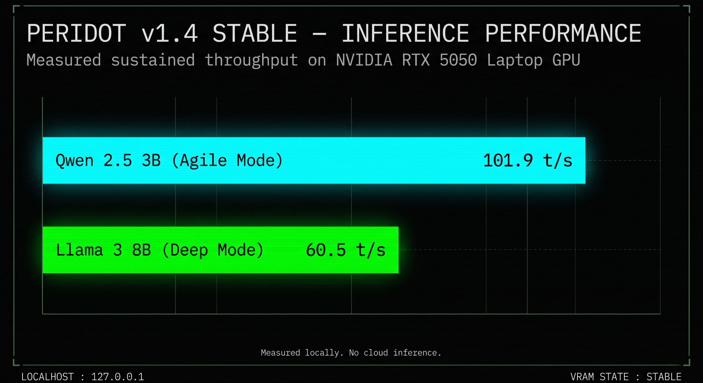
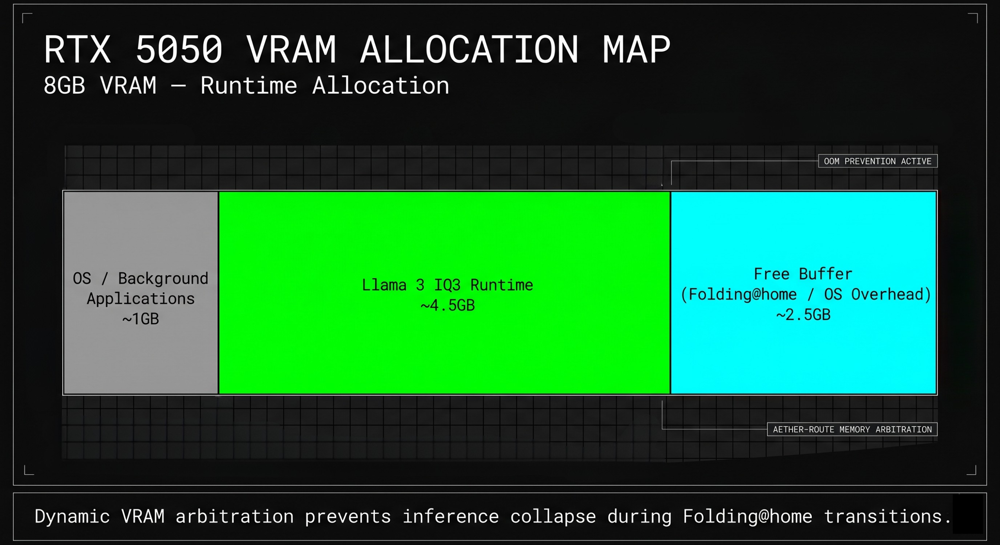
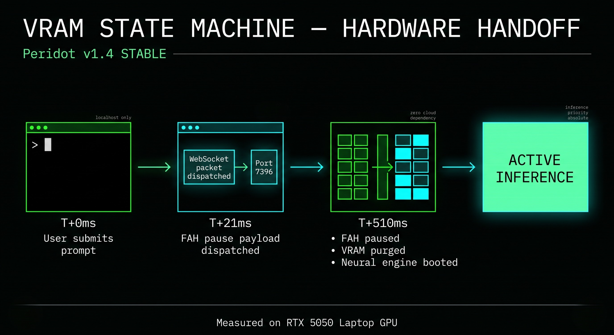
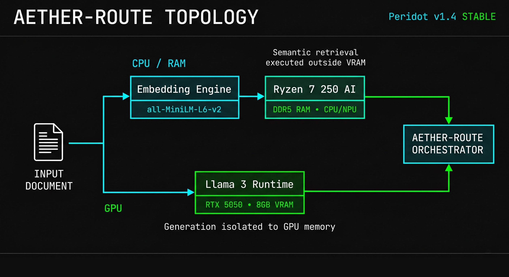
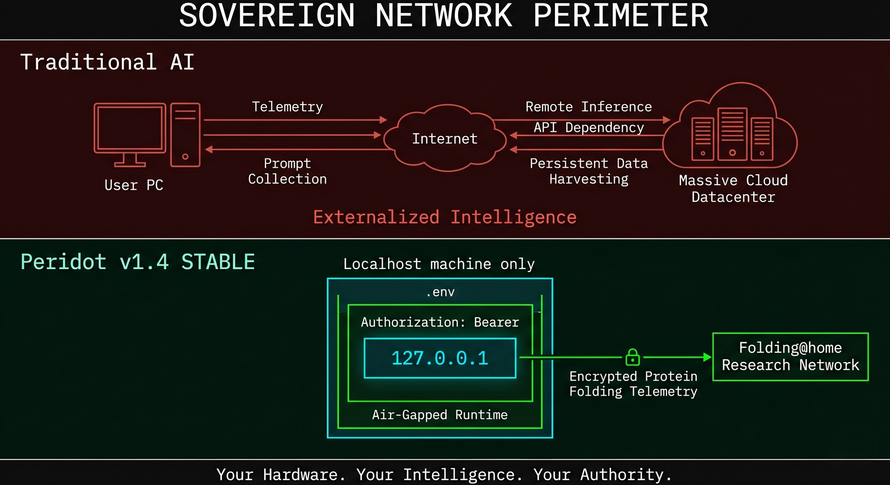

<div align="center">

```
██████╗ ███████╗██████╗ ██╗██████╗  ██████╗ ████████╗
██╔══██╗██╔════╝██╔══██╗██║██╔══██╗██╔═══██╗╚══██╔══╝
██████╔╝█████╗  ██████╔╝██║██║  ██║██║   ██║   ██║   
██╔═══╝ ██╔══╝  ██╔══██╗██║██║  ██║██║   ██║   ██║   
██║     ███████╗██║  ██║██║██████╔╝╚██████╔╝   ██║   
╚═╝     ╚══════╝╚═╝  ╚═╝╚═╝╚═════╝  ╚═════╝    ╚═╝   
```

# `PERIDOT SOVEREIGN KERNEL`

### `SOVEREIGN LOCAL AI KERNEL — v1.4.0 STABLE`

[](https://github.com/uncoalesced/Peridot/releases)
[](https://github.com/uncoalesced/Peridot/blob/main/COMMUNITY_INSTALL.md)
[](https://github.com/uncoalesced/Peridot/blob/main/SECURITY.md)

<br>

[](LICENSE)
[](https://python.org)

<br>

**Engineered by [uncoalesced](https://github.com/uncoalesced)**

*GPU-accelerated, air-gapped sovereign AI runtime with defense-in-depth security and hardware-aware orchestration.*  
*Zero telemetry. Zero cloud dependency. Absolute user sovereignty.*

</div>

---

# `> OVERVIEW`

Peridot is a sovereign local AI kernel engineered to execute entirely on user-owned hardware without external dependency, cloud inference, telemetry collection, or remote orchestration.

The runtime combines:
- Local LLM inference
- Permission-gated execution
- Dynamic VRAM arbitration
- Hardware-aware telemetry routing
- Local Retrieval-Augmented Generation (RAG)
- Asynchronous forensic auditing
- Immutable logging infrastructure

Unlike cloud-first AI platforms, Peridot was architected around:
- deterministic local execution
- transparent orchestration
- operator sovereignty
- hardware-aware optimization
- zero telemetry dependency

Most AI assistants are surveillance infrastructure with a chat interface.

Peridot is the opposite.

Peridot was built around a simple principle:

```text
The user owns the machine.
Therefore the user controls the intelligence running on it.
```

Unlike cloud first assistants, Peridot does not:
- transmit prompts externally
- require external inference APIs
- rely on cloud orchestration
- force locked safety layers
- hide execution behavior from the operator

Every subsystem is locally inspectable, locally auditable, and locally controllable.

> **Development Note**  
> Peridot's runtime architecture, telemetry systems, security infrastructure, inference pipeline, orchestration layers, setup wizard, VRAM state machine, and kernel logic are human engineered.
>
> AI-generated code is used exclusively inside the `benchmarking/` suite for telemetry automation and validation tooling.

```text
┌─────────────────────────────────────────────────────────┐
│  USER INPUT                                             │
│     │                                                   │
│     ▼                                                   │
│  SECURITY GATE                                          │
│  • Input Sanitization                                   │
│  • File Access Blacklist                                │
│  • Path Traversal Prevention                            │
│     │                                                   │
│     ▼                                                   │
│  PERMISSION LAYER                                       │
│  • constitution.json                                    │
│  • Function Call Authorization                          │
│     │                                                   │
│     ▼                                                   │
│  AETHER-ROUTE v1.4                                      │
│  • Hardware-Aware Telemetry                             │
│  • Semantic Routing                                     │
│  • Dynamic VRAM Arbitration                             │
│  • CPU-Offloaded Embedding Pipeline                     │
│  • Local RAG Pipeline                                   │
│     │                                                   │
│     ▼                                                   │
│  INFERENCE ENGINE                                       │
│  • Llama-3-8B-Instruct (IQ3_XXS)                        │
│  • Qwen 2.5 3B (Q4_K_M)                                 │
│  • llama-cpp-python + cuBLAS                            │
│  • localhost:5000 (local-only)                          │
│  • 60.5–101.9 tokens/sec sustained inference            │
│     │                                                   │
│     ▼                                                   │
│  GHOSTLOGGER                                            │
│  • Asynchronous Security Auditing                       │
│  • Tamper-Evident Logging                               │
│  • Forensic Event Persistence                           │
│     │                                                   │
│     ▼                                                   │
│  AUDIT LAYER                                            │
│  • SHA-256 Verified                                     │
│  • Append-Only Logging                                  │
│  • Security Event Isolation                             │
└─────────────────────────────────────────────────────────┘
```

---

# `> PERFORMANCE`

Measured on real hardware. No overclocking. No cherry picked runs.

### Test Hardware

- **GPU:** NVIDIA GeForce RTX 5050 Laptop (8GB VRAM)
- **CPU:** AMD Ryzen 7 250 AI
- **Runtime Profiles:** Deep Thinker / Agile Mode

---

## TurboQuant Runtime Profiles

Peridot v1.4.0 STABLE introduces the:

```text
TurboQuant Architecture
```

The legacy Llama Q4_K_M baseline was deprecated due to excessive VRAM saturation on 8GB hardware.

Peridot now dynamically prioritizes:
- Importance Matrix Quants (I-Quants)
- FP4-oriented execution paths
- reduced VRAM pressure
- sustained inference throughput
- stable Folding@Home coexistence

### Deep Thinker Profile

```text
Model:        Llama-3-8B-Instruct (IQ3_XXS)
Throughput:   60.5 t/s
VRAM Usage:   ~4.5GB
Purpose:      Maximum reasoning depth and RAG accuracy
```

Deep Thinker prioritizes:
- Semantic depth
- Long-context reasoning
- Grounded document citation
- Hallucination reduction

This is the primary high fidelity execution path.

---

### Agile / Daily Driver Profile

```text
Model:        Qwen 2.5 3B (Q4_K_M)
Throughput:   101.9 t/s
VRAM Usage:   ~2.7GB
Purpose:      High-speed local interaction
```

Qwen trades deep reasoning for raw throughput.

The Agile profile leaves substantial VRAM overhead available for:
- Folding@Home
- Background telemetry
- Large OS overhead
- Sustained multitasking

---

## Benchmark Visualization

<div align="center">



</div>

---

## VRAM Allocation Map

Peridot v1.4 aggressively minimizes VRAM pressure to preserve:
- Inference stability
- Folding@Home handoff responsiveness
- CUDA reliability
- Long session runtime integrity

<div align="center">



</div>

---

## Dynamic VRAM Arbitration

Dynamic GPU resource arbitration between Folding@Home and active inference execution.

### Measured Runtime Behavior

- **WebSocket Interrupt Dispatch:** ~21ms
- **Full VRAM Purge + Handoff:** <510ms
- **Inference Priority:** Absolute

### Technical Implementation

When a user query enters the inference queue:

1. Peridot dispatches a WebSocket pause signal
2. Folding@Home releases active VRAM allocation
3. The inference engine immediately reclaims tensor memory
4. Generation begins without runtime restart overhead

This allows Peridot to maintain:
- Uninterrupted inference responsiveness
- Persistent distributed medical research
- Stable VRAM reclamation
- Deterministic hardware transitions

Inference execution always takes priority.

<div align="center">



</div>

---

# `> SECURITY`

Peridot implements a hardened defense in depth architecture engineered to protect the inference runtime from malicious prompts, unauthorized file access, unsafe subprocess execution, and privilege escalation attempts.

The Kernel assumes:

```text
All input is potentially hostile until validated otherwise
```

Security boundaries are enforced before the inference layer is permitted to interact with:
- The filesystem
- Subprocess execution
- Network interfaces
- External resources
- Privileged runtime operations

---

## Input Sanitization

All prompts are sanitized before entering the inference pipeline.

Blocked patterns include:

```python
<script>         # XSS attacks
eval()           # Arbitrary code execution
os.system()      # Shell injection
__import__       # Python import abuse
subprocess.      # Subprocess exploitation
```

Malicious prompts are rejected before execution and logged asynchronously through GhostLogger.

Security violations are isolated to:

```text
logs/ghost_audit.log
```

---

## Cryptographic Handshake Architecture

Peridot v1.4 abandons static credential configuration entirely.

The runtime now generates:
- Localized `.env` authentication
- Ephemeral 16-byte API keys
- Isolated environment authentication boundaries

During setup initialization.

The setup wizard additionally enforces:

```text
HF_HUB_OFFLINE=1
```

to sever unauthorized HuggingFace telemetry routing at the environment level.

No API key files are committed to disk repositories.

No cloud authorization exists.

---

## File Access Blacklist

The kernel actively blocks access to sensitive files and restricted directories before the inference layer is permitted to interact with the host filesystem.

### Blocked Files
- `.env`
- `.ssh/id_rsa`
- `passwords.txt`
- `auth.token`

### Blocked Directories
- `C:\Windows\`
- `/etc/`
- `/root/`
- `/boot/`

Path traversal attacks such as:

```text
../../../etc/passwd
```

are automatically neutralized through path normalization and permission validation before file execution paths are resolved.

---

## GhostLogger

GhostLogger is Peridot's asynchronous forensic auditing subsystem.

It functions as a silent observer operating independently from the primary inference and UI execution paths.

GhostLogger intercepts and records:
- Authentication failures
- Unauthorized file access attempts
- Malicious prompt injections
- Constitution validation failures
- Blocked subprocess calls
- Runtime security violations

without interrupting inference execution.

### Design Goals

GhostLogger was engineered around three priorities:

```text
Persistence
Isolation
Forensic Integrity
```

Even if the UI or inference engine experiences sustained load, GhostLogger continues operating independently to preserve a persistent forensic trail for auditing and security analysis.

For full threat model documentation and disclosure policy, see [`SECURITY.md`](SECURITY.md).

---

# `> ARCHITECTURE`

Peridot is engineered as a layered sovereign runtime composed of isolated but composable subsystems.

Each module can:
- Operate independently
- Be expanded individually
- Be disabled without collapsing the kernel
- Communicate through controlled execution boundaries

The architecture intentionally prioritizes:

```text
Transparency
Security
Deterministic Local Execution
```

over abstraction-heavy orchestration.

---

# `> CORE ARCHITECTURE & FEATURE MATRIX`

## **1. Aether-Route RAG Topology**

Peridot v1.4 hardcodes semantic embedding workloads away from VRAM-intensive inference execution.

The architecture intentionally isolates:
- Embedding generation
- Semantic indexing
- Retrieval orchestration

onto:
- CPU resources
- DDR5 memory
- Ryzen AI acceleration paths

while preserving GPU VRAM strictly for tensor generation.

This separation prevents:
- Out-Of-Memory failures
- VRAM starvation
- Unstable CUDA transitions
- Degraded Folding@Home handoffs

<div align="center">



</div>

---

## **2. High-Velocity RAG Pipeline**

Peridot's Retrieval-Augmented Generation pipeline operates entirely within localized memory space for deterministic, zero-cloud context retrieval.

### Vector Search Layer

Uses `faiss-cpu` for:
- High-density vector indexing
- Semantic similarity retrieval
- RAM-resident search acceleration

without requiring external vector databases.

### Semantic Embedding Layer

Powered by `sentence-transformers` to generate localized semantic embeddings directly on-device.

Embedding execution is forced strictly toward:
- CPU
- RAM
- Ryzen AI resources

to preserve VRAM overhead for inference execution.

### Context Injection Pipeline

Relevant document chunks are dynamically injected into the active sliding context window before generation begins.

This allows:
- Grounded responses
- Local document reasoning
- Mathematically relevant context retrieval
- Internet-independent augmentation

without external API routing.

---

## **3. Optimized Local Inference Engine**

The inference layer is engineered specifically for:
- Constrained VRAM systems
- Sustained tensor workloads
- Ryzen/NVIDIA hybrid systems
- Low-overhead local execution
- Distributed compute coexistence

### GGUF Runtime

Built on `llama-cpp-python` with `cuBLAS` GPU acceleration, allowing heavily quantized models to remain performant within constrained VRAM budgets.

### TurboQuant Execution

Peridot v1.4 introduces:
- IQ3_XXS support
- Aggressive VRAM reduction
- Reduced memory bus saturation
- Improved tensor throughput
- Stable low-VRAM operation

while preserving reasoning quality.

---

## `[01] — Inference Engine`

Core inference runtime:

```text
Primary Model:   Llama-3-8B-Instruct (IQ3_XXS)
Agile Model:     Qwen 2.5 3B (Q4_K_M)
Backend:         llama-cpp-python + cuBLAS
Endpoint:        localhost:5000 (local-only)
Context:         8192 tokens (sliding window)
Temperature:     0.1
Execution:       Fully Local
```

### Why IQ3_XXS?

Importance Matrix Quantization dramatically reduces VRAM pressure while preserving high-level reasoning capability.

Compared against the legacy Q4_K_M baseline:
- lower VRAM saturation
- improved sustained throughput
- faster tensor allocation
- better Folding@Home coexistence
- increased runtime stability

on constrained hardware.

---

## `[02] — Medical Research Module (Folding@Home Integration)`

When idle, Peridot can allocate unused GPU resources toward distributed medical research through Folding@Home.

### Idle State

```text
GPU Utilization:  <5%
Action:           Folding@Home activated
Research:         Cancer, Alzheimer's, Parkinson's
```

### Active State

```text
User query detected
Action:           WebSocket pause signal dispatched
Interrupt:        ~21ms
Full Handoff:     <510ms
GPU Utilization:  85%+ (inference)
```

### Runtime Characteristics

- Opt-in only
- Fully auditable
- Zero restart overhead
- Dynamic VRAM arbitration
- Inference-priority execution
- Transparent runtime state tracking
- Aggressive idle return logic

### Commands

```text
research enable
research disable
research status
```

---

# `> HARDWARE SUPPORT`

| Tier | Hardware | Mode | Expected Speed |
|:-----|:---------|:----:|:--------------:|
| ✅ **Full Support** | NVIDIA RTX 4050+ (8GB+) | Deep Thinker | 50–65 t/s |
| ✅ **Full Support** | NVIDIA RTX 4050+ (8GB+) | Agile | 90–110 t/s |
| ✅ **Validated** | NVIDIA RTX 5050 (8GB) | Deep Thinker | **60.5 t/s** |
| ✅ **Validated** | NVIDIA RTX 5050 (8GB) | Agile | **101.9 t/s** |
| ⚙️ **CPU Fallback** | Modern x64 CPUs | CPU-Only | 10–20 t/s |
| ⚠️ **Lite Mode** | AMD Radeon 680M/780M | Lite | 8–15 t/s |
| ⚠️ **Lite Mode** | Intel Iris Xe | Lite | 5–10 t/s |
| 🛠️ **Community** | AMD RX 6000/7000 series | ROCm (Linux) | 35–70 t/s |
| 🛠️ **Community** | Intel Arc A750/A770 | Vulkan | 25–42 t/s |

Peridot is optimized for modern high-performance GPUs, but aggressively engineered to remain operational on constrained hardware under 8GB VRAM.

CPU-only execution paths remain fully supported at reduced throughput.

**Community Builds:** Maintained by contributors. Community deployment documentation may lag behind stable runtime architecture revisions. See [`COMMUNITY_INSTALL.md`](COMMUNITY_INSTALL.md).

---

# `> INSTALLATION`

## Prerequisites

```text
OS:      Windows 10/11 (64-bit)
GPU:     NVIDIA RTX Series recommended
Python:  3.11
Storage: ~10GB free (SSD strongly recommended)
RAM:     16GB recommended
```

---

## Setup

### 1. Clone Repository

```bash
git clone https://github.com/uncoalesced/Peridot.git
cd Peridot
```

---

### 2. Create Virtual Environment

```bash
python -m venv venv
.\venv\Scripts\activate
```

---

### 3. Run Setup Wizard

The v1.4 setup wizard:
- profiles GPU VRAM automatically
- validates hardware compatibility
- configures the security perimeter
- generates cryptographic authentication
- injects offline telemetry suppression
- presents execution-path selection
- downloads recommended runtime weights

```bash
python setup.py
```

### Engine Tuning Interface

The setup wizard intercepts initialization and presents two execution directives:

#### Deep Thinker

```text
Llama 3 8B (IQ3_XXS)
~60 t/s
~4.7GB VRAM
```

Pros:
- maximum reasoning depth
- strict RAG citation behavior
- high semantic accuracy

Cons:
- reduced VRAM overhead for Folding@Home

---

#### Agile / Daily Driver

```text
Qwen 2.5 3B (Q4_K_M)
~100+ t/s
~2.7GB VRAM
```

Pros:
- instantaneous generation
- massive VRAM overhead
- ideal for multitasking + research contribution

Cons:
- smaller parameter count
- weaker multi-document reasoning depth

---

#### Manual Matrix Override

Advanced users may bypass automatic recommendations and expose all raw hardware profiles manually.

---

# `> ROADMAP`

```text
[████████████████████] v1.2 BETA      Security Hardening + Benchmarking
[████████████████████] v1.3 BETA RAG  Engine (Document Analysis)
[████████████████████] v1.4.0 STABLE  TurboQuant Architecture
[████░░░░░░░░░░░░░░░░] v1.5           Linux Support
[░░░░░░░░░░░░░░░░░░░░] v1.6           AMD GPU Support (ROCm)
[░░░░░░░░░░░░░░░░░░░░] v1.7           macOS Support (Apple Silicon)
[░░░░░░░░░░░░░░░░░░░░] v2.0           WebUI (FastAPI + React)
```

**Current Focus (v1.4.0 STABLE)**

TurboQuant optimization, runtime stability, VRAM arbitration refinement, and expanded sovereign local inference infrastructure.

---

# `> PHILOSOPHY`

Peridot exists because the AI industry's default assumption is that **your data belongs to them**.

It does not.

Every design decision reflects a single principle:

```text
the user is sovereign
```

That means:
- no telemetry without explicit consent
- no autonomous action without permission
- no hidden cloud inference
- no unremovable execution boundaries
- no ethical guardrails that cannot be modified by the operator

The `config/constitution.json` system ships with sensible defaults.

You can:
- make them stricter
- make them looser
- remove them entirely

That decision belongs to the user, not the developer.

<div align="center">



</div>

**This is what AI should look like.**

For our full philosophical reasoning, see [`PHILOSOPHY.md`](PHILOSOPHY.md).

---

# `> LICENSE & DISCLAIMER`

**License:** AGPL-3.0 — fork it, modify it, audit it, deploy it locally.

**Disclaimer:** Peridot is experimental software. The operator assumes responsibility for all commands executed, hardware utilization, and generated content. Provided as-is without warranty of any kind.

---

<div align="center">

`PERIDOT` · `SOVEREIGN AI KERNEL` · `v1.4.0 STABLE`

**Engineered by [uncoalesced](https://github.com/uncoalesced)**

*Your hardware. Your model. Your rules.*

</div>