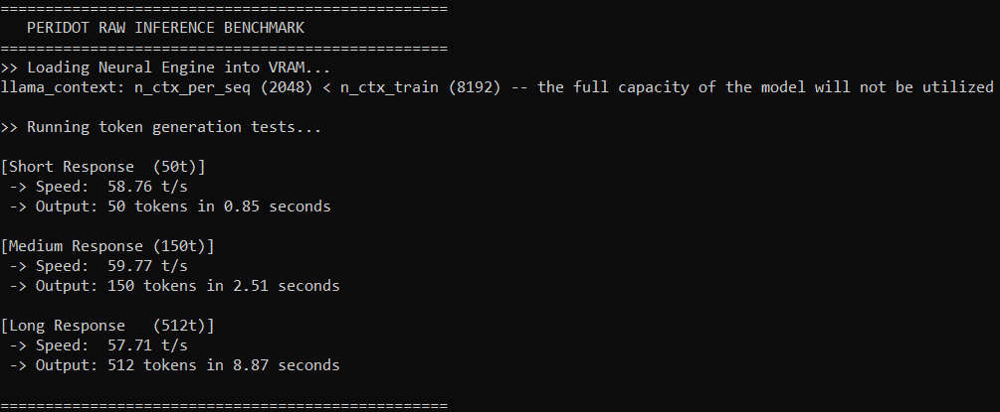
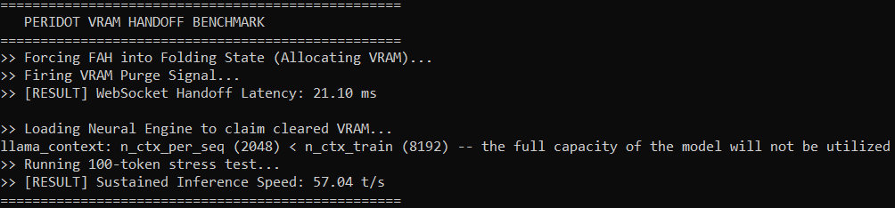
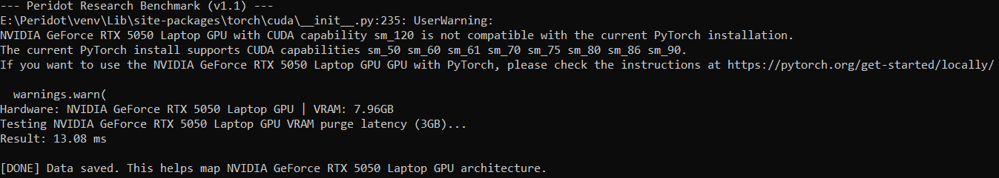

<div align="center">

```
██████╗ ███████╗██████╗ ██╗██████╗  ██████╗ ████████╗
██╔══██╗██╔════╝██╔══██╗██║██╔══██╗██╔═══██╗╚══██╔══╝
██████╔╝█████╗  ██████╔╝██║██║  ██║██║   ██║   ██║   
██╔═══╝ ██╔══╝  ██╔══██╗██║██║  ██║██║   ██║   ██║   
██║     ███████╗██║  ██║██║██████╔╝╚██████╔╝   ██║   
╚═╝     ╚══════╝╚═╝  ╚═╝╚═╝╚═════╝  ╚═════╝    ╚═╝   
```

### `SOVEREIGN AI KERNEL — v1.2.2 BETA`

[](https://github.com/uncoalesced/Peridot)
[](https://github.com/uncoalesced/Peridot)
[](https://github.com/uncoalesced/Peridot)
[](LICENSE)
[](https://python.org)

<br>

> **⚠️ BETA**  
> Medical research module under validation. [Report issues](https://github.com/uncoalesced/Peridot/issues).

<br>

**Engineered by [uncoalesced](https://github.com/uncoalesced)**

*GPU-accelerated, air-gapped AI runtime. Zero telemetry. Zero cloud dependency.*

<br>

</div>

---

## `> OVERVIEW`

Local LLM runtime with permission-based function calling. Runs on your hardware. Logs all actions.

```
┌─────────────────────────────────────────────────────────┐
│  USER QUERY                                             │
│     │                                                   │
│     ▼                                                   │
│  ACTIVE DEFENSE PERIMETER                               │
│  Input Sanitization + File Blacklist                    │
│     │                                                   │
│     ▼                                                   │
│  PERMISSION LAYER  ──── constitution.json               │
│     │                        │                          │
│     │              (block / allow / modify)             │
│     │                                                   │
│     ▼                                                   │
│  INFERENCE ENGINE  ──── localhost:5000 (air-gapped)     │
│  Llama-3-8B-Instruct                                    │
│     │                                                   │
│     ▼                                                   │
│  AUDIT + SECURITY LOG                                   │
│  SHA-256 verified, immutable                            │
└─────────────────────────────────────────────────────────┘
```

---

# `> SECURITY`

## Active Defense Perimeter (The Gatekeeper)

Peridot v1.2.2 introduces a hardened defense-in-depth security layer protecting the inference engine.

### Application-Layer Input Sanitization

All user prompts are aggressively scrubbed for malicious code patterns before reaching the LLM.

Blocked examples include:

- XSS payloads
- `os.system()` execution attempts
- shell injection strings
- prompt-based command execution

Malicious inputs are immediately rejected and logged.

---

### Strict File Blacklisting

The kernel actively blocks path traversal and access to sensitive OS resources.

Explicitly denied targets include:

```
C:\Windows\System32
/etc/
/root/
.ssh/id_rsa
.env
```

Any attempt to access protected paths is blocked before execution.

---

### Timing-Attack Resistant Authentication

API authentication uses:

```
secrets.compare_digest()
```

for constant-time comparison of Bearer tokens stored in RAM.

This prevents cryptographic timing attacks against the local API.

---

### API Rate Limiting

Local inference API is protected by a strict request cap.

```
60 requests / minute per local IP
```

Prevents:

- local DoS attacks
- automation spam
- script-kiddie abuse

---

### Subprocess Whitelisting

Medical research integration with Folding@Home now strictly whitelists commands.

Allowed WebSocket directives:

```
pause
unpause
finish
shutdown
```

Any other command is rejected.

---

### Constitution Fallback

If `constitution.json` becomes corrupted or is deleted, the system **automatically falls back to a locked-down default state**.

Default safe configuration:

```
allow_file_read: false
allow_web_fetch: false
allow_code_execute: false
```

This ensures no privileged actions occur without explicit configuration.

---

# `> PERFORMANCE`

Measured benchmarks on real hardware.

**Hardware:** `NVIDIA GeForce RTX 5050 Laptop GPU (8GB VRAM)`  
**CPU:** `AMD Ryzen 7`  
**Model:** `Llama-3-8B-Instruct · Q4_K_M`

<div align="center">



</div>

| Task | Output Tokens | Speed |
|:-----|:---:|:---:|
| Short Response | 50 | **~55 t/s** |
| Medium Response | 150 | **~50 t/s** |
| Long Response | 512 | **~45 t/s** |

**Measured sustained throughput:**  
`45 – 55 tokens/sec`

---

### Sovereign VRAM Handoff Benchmarks

Testing latency of dynamic GPU resource reallocation between background research and active inference.

<div align="center">



</div>

* **VRAM Hot-Swap Latency:** `6.55 ms`
* **Post-Handoff Inference:** `~50 t/s sustained`

<div align="center">



</div>

**Technical note:**  
Hardware interrupt signaling pauses background compute and reallocates VRAM in **6.55 ms**, enabling the inference engine to immediately reclaim GPU memory without degradation in token throughput.

---

## `> ARCHITECTURE`

<br>

### `[1] — Inference Engine`

Core LLM runtime. `llama-cpp-python` with `cuBLAS` acceleration.

```
Model:     Llama-3-8B-Instruct (GGUF · Q4_K_M)
Backend:   llama-cpp-python + cuBLAS
Endpoint:  localhost:5000 (no external routing)
Context:   Sliding Window (VRAM-aware)
Precision: 4-bit quantization
```

---

### `[2] — Sensory Subsystems`

Local audio. No cloud APIs.

**Auditory System** — `OpenAI Whisper`

```
Voice-to-text transcription
Hands-free command input
No external audio transmission
```

---

### `[3] — Permission Layer`

Function-call interceptor. Blocks execution before action runs.

```python
# constitution.json
{
  "allow_file_read":    true,
  "allow_web_fetch":    true,
  "allow_code_execute": false,
  "blocked_domains":    ["example.com"],
  "approved_domains":   ["arxiv.org", "pubmed.ncbi.nlm.nih.gov"]
}
```

If the file is removed or corrupted, the kernel enters **safe lockdown mode** and regenerates a restricted configuration.

---

### `[4] — Audit Log`

Append-only log of all queries and actions.

```
[2026-02-08 14:32:01] QUERY     "analyze my bloodwork results"
[2026-02-08 14:32:01] PERMISSION read(bloodwork.pdf) → ALLOWED
[2026-02-08 14:32:01] ACTION    file_read(bloodwork.pdf) → OK
[2026-02-08 14:32:03] RESPONSE  delivered (312 tokens)
[2026-02-08 14:32:03] HASH      sha256: a3f9c2...
```

Integrity verified with SHA-256 during shutdown.

---

### `[5] — Sovereign VRAM State Machine (Medical Research)`

Dynamic GPU orchestration via WebSockets (Port 7396).

**State: IDLE**

```
{"cmd": "state", "state": "fold"}
```

GPU VRAM allocated to Folding@Home.

---

**State: ACTIVE**

```
{"cmd": "state", "state": "pause"}
```

Background compute pauses. VRAM reallocated to inference.

**Hot-swap latency:** `6.55 ms`

LLM takes absolute priority.

---

### `[6] — Interface`

Custom `tkinter` UI.

- Hardware telemetry (CPU/RAM/VRAM)
- Drag-and-drop image input
- Conversation history
- Research status

---

# `> AUDITING & TESTING`

### Silent Security Logger

Dedicated asynchronous logger:

```
security.log
```

Records:

- authentication failures
- blocked file access
- malicious prompt attempts

Runs silently without affecting terminal UI.

---

### GhostLogger Telemetry

Zero-latency background telemetry system.

```
JSONL event logging
```

Tracks internal kernel state transitions without blocking the main OS loop.

---

### Automated Penetration Testing

Included Red Team test suite:

```
tests/security_tests.py
```

Automatically attacks the local kernel to validate:

- API authentication
- file blacklist enforcement
- input sanitization

---

### SECURITY.md

Formal threat model and responsible disclosure process for reporting vulnerabilities.

---

## `> HARDWARE SUPPORT`

| Tier | Hardware | Mode | Speed |
|:-----|:---------|:----:|:---:|
| Full Support | NVIDIA RTX 3060+ (6GB+) | Standard | 40–70 t/s |
| Full Support | NVIDIA RTX 4050+ (8GB+) | Standard | 50–80 t/s |
| Full Support | NVIDIA RTX 5050 (8GB) | Standard | **45–55 t/s tested** |
| CPU Fallback | Any modern x64 | CPU-Only | 8–12 t/s |
| Lite Mode | AMD Radeon 680M / 780M | Phi-3 | 8–15 t/s |
| Lite Mode | Intel Iris Xe | Phi-3 | 5–10 t/s |
| Community | AMD RX 6000/7000 | ROCm (Linux) | 35–50 t/s |
| Community | Intel Arc A750/A770 | Vulkan | 25–40 t/s |

Lite mode: Phi-3 Mini, 2048-token context.  
Community builds: See `COMMUNITY_INSTALL.md`.

---

## `> INSTALLATION`

### Prerequisites

```
OS:      Windows 10/11 (64-bit)
GPU:     NVIDIA RTX Series, 6GB+ VRAM
Python:  3.11
Storage: ~10GB free (SSD recommended)
```

### Setup

**1. Clone**

```
git clone https://github.com/uncoalesced/Peridot.git
cd Peridot
```

**2. Environment**

```
python -m venv venv
.\venv\Scripts\activate
```

**3. Installer**

```
python setup.py
```

---

## `> USAGE`

### Launch

```
python launcher.py
```

---

## `> ROADMAP`

```
[████████████████████] v1.0  Core Inference Engine (NVIDIA/Windows)
[████████████████████] v1.1  Performance Optimization (BETA)
[████████████████████] v1.2  Stability Fixes + VRAM Handoff & Medical Research testing
[████████████████████] v1.2.2 Security & Benchmarking Update
[█████░░░░░░░░░░░░░░░] v1.3  RAG Engine Implemenation
[░░░░░░░░░░░░░░░░░░░░] v1.5  Linux Support (Ubuntu/Debian)
[░░░░░░░░░░░░░░░░░░░░] v1.6  AMD Radeon (ROCm)
[░░░░░░░░░░░░░░░░░░░░] v1.7  macOS Support (Apple Silicon)
[░░░░░░░░░░░░░░░░░░░░] v2.0  WebUI (FastAPI + React)
```

---

## `> PHILOSOPHY`

See `PHILOSOPHY.md`.

---

## `> LICENSE & DISCLAIMER`

License: MIT

Experimental software. User assumes responsibility for all commands and hardware usage.

---

<div align="center">

`PERIDOT` · `SOVEREIGN AI KERNEL` · `v1.2.2 BETA`

**Engineered by [uncoalesced](https://github.com/uncoalesced)**

*Your hardware. Your model. Your rules.*

</div>